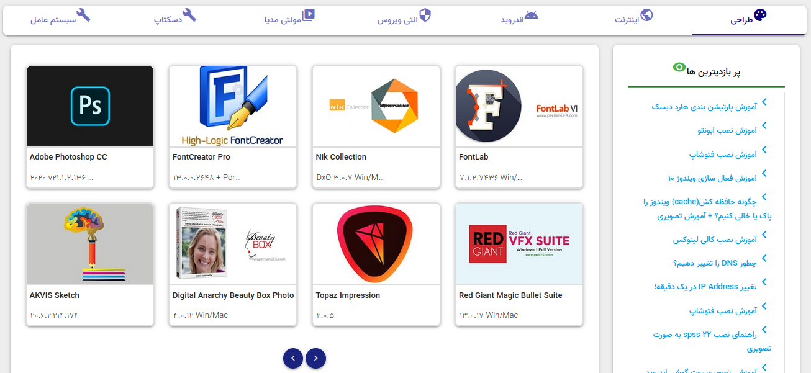
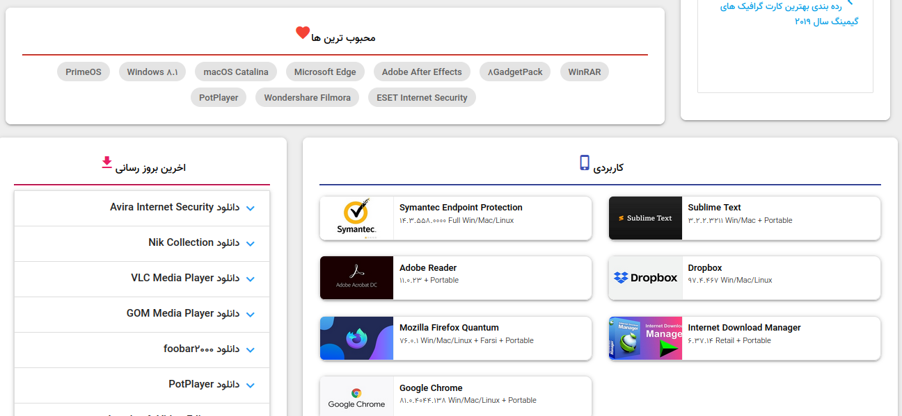
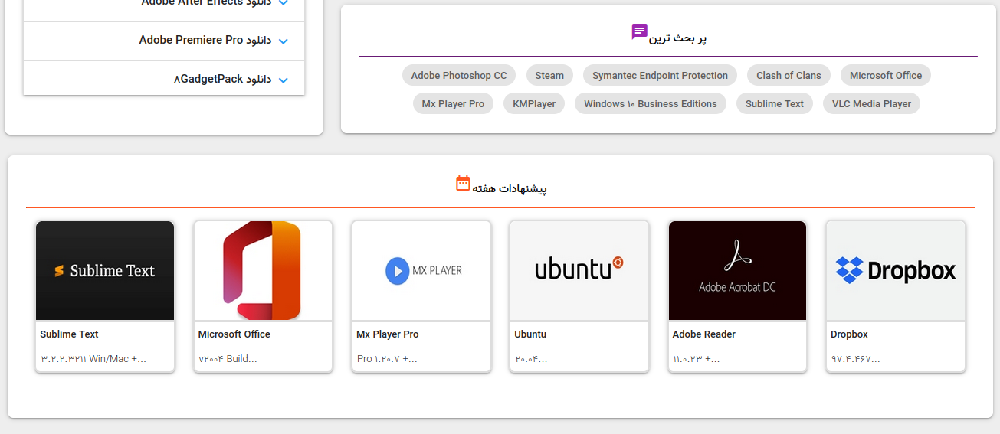
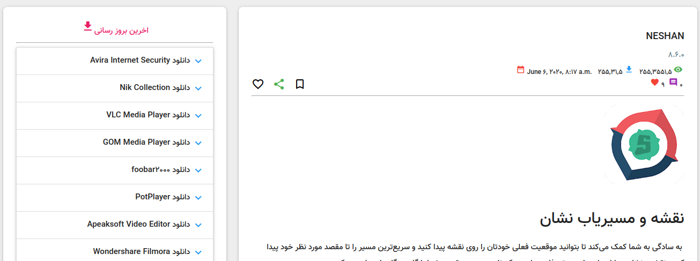
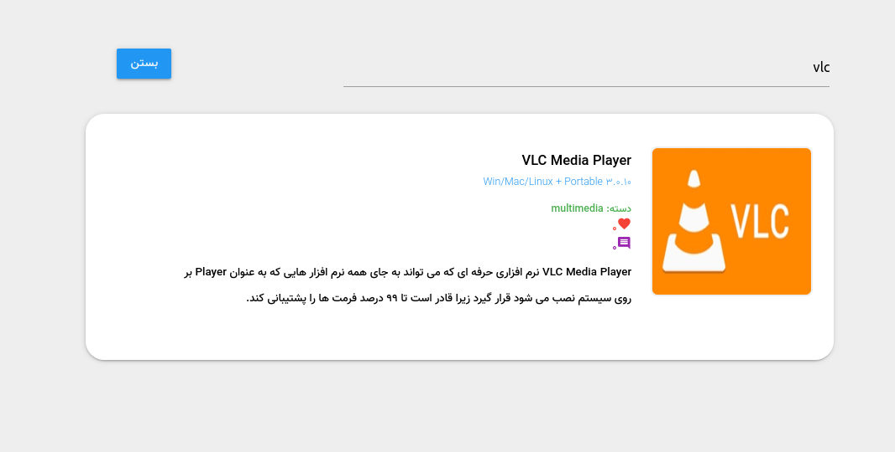
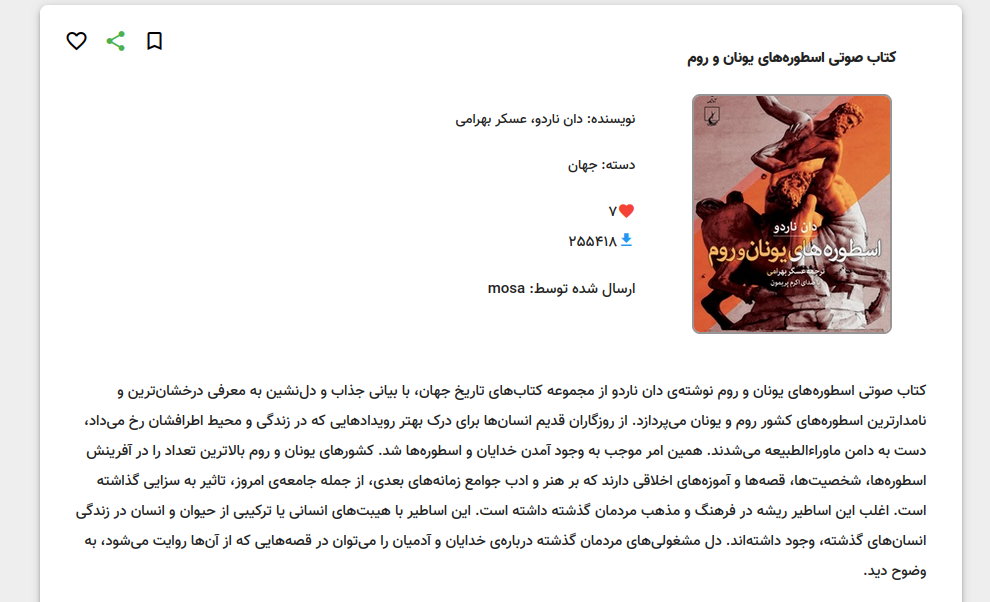
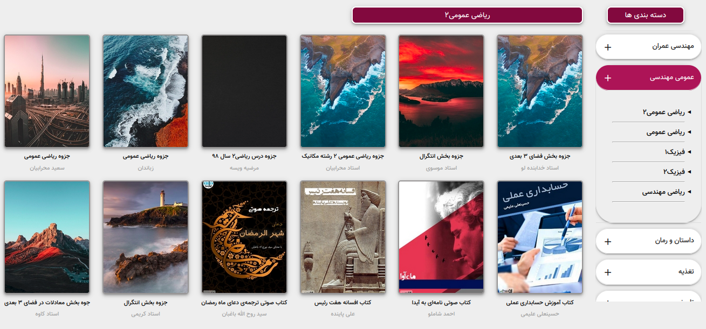

# khu_download_center

an simple download center for khu (software, book)

this is my first django application :)

> download book, software

> upload book

> request for software

> blog

 

**see in [Link](https://mohammad5040.pythonanywhere.com/)**

 

